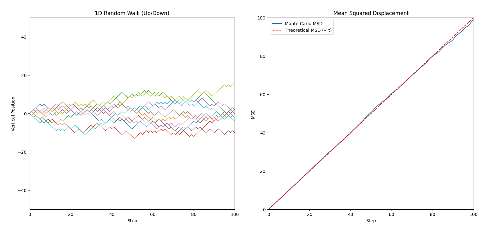
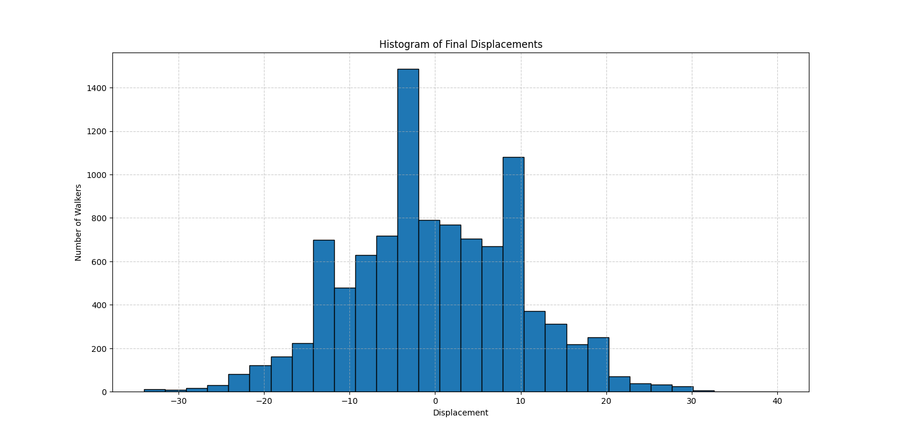

# 1D Random Walk Simulation

This project simulates a 1D random walk for multiple walkers and visualizes their trajectories, the mean squared displacement (MSD), and the final displacement distribution.

## Features
- Animated plot of up to 10 random walker trajectories (for clarity)
- Real-time calculation and display of MSD and theoretical MSD
- Histogram of final displacements after the simulation
- User input for number of steps, probability of moving up, and number of walkers

## Requirements
- Python 3.13+
- numpy
- matplotlib

## Usage
1. Install requirements:
   ```bash
   pip install numpy matplotlib
   ```
2. Run the simulation:
   ```bash
   python 1d-random-walk.py
   ```

3. Follow the prompts to enter the number of steps, probability of moving up, and number of walkers.

## Sample Output

With the following user inputs:
- Number of steps: 100
- Probability of moving up: 0.5
- Number of walkers: 1000


You will see outputs similar to:

**Diffusion Coefficient (D):**
- Theoretical value: D = 0.5
- Estimated value (example): D ≈ 0.49

### Animated Plot


### Final Displacement Histogram


- Animated plot of up to 10 random walker trajectories and MSD
- Histogram of final displacements

- Only up to 10 random walker trajectories are shown for clarity, regardless of the total number of walkers.
- The measured diffusion coefficient and theoretical value are printed at the end of the simulation.
